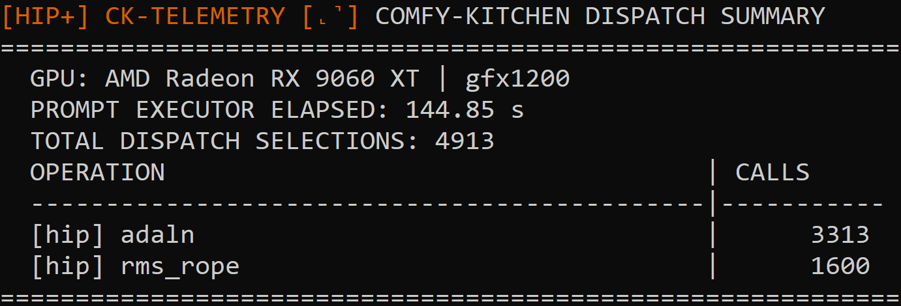
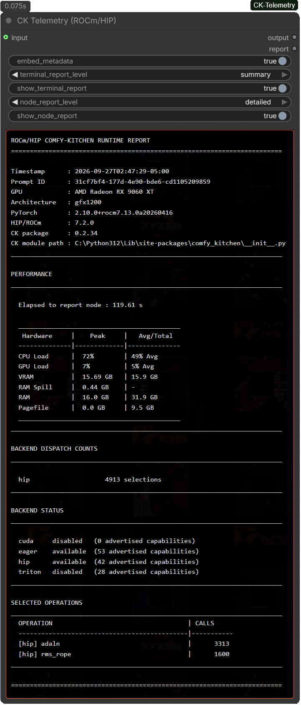

# CK-Telemetry

**Comfy Kitchen Telemetry for AMD ROCm/HIP on Windows**

A lightweight ComfyUI diagnostic tool built around **Comfy Kitchen** that sheds light on such questions as:

- **What Comfy Kitchen actually selected?**
- **What the system was doing while the prompt ran?**

## <u>Ultimately providing useful insight for :</u>

- **performance benchmarking**
- **testing Comfy Kitchen builds and development branches**
- **comparing different models and quantizations**
- **validating expected backend selection**
- **investigating how a workload uses GPU and system resources**
- **simply satisfying curiosity about what a particular workflow is doing**

## <u>CK-Telemetry can collect and report :</u>

* Selected backend operations
* Number of selections for each operation
* Dispatch failures when they are reported by the registry
* Comfy Kitchen package/version information
* PyTorch and HIP/ROCm runtime information
* Active GPU name and architecture
* CPU utilization
* GPU engine utilization
* GPU VRAM usage
* Precise shared GPU memory usage
* System RAM usage
* Disk-backed pagefile usage
* Workflow/to-node elapsed time

---

## <u>Terminal telemetry reporting</u>

You do **not** have to add the CK-Telemetry node to every workflow to get reports.

There is the option to set either of these environment variables:

```bat
set COMFY_KITCHEN_TELEMETRY=1
```

That enables a compact, **summary** terminal report for each run of the ComfyUI session.


While this enables a **detailed** terminal report for each run of the ComfyUI session :

```bat
set COMFY_KITCHEN_TELEMETRY=2
```

---



---

**Worth noting:** <i>When the CK-Telemetry node is also involved it does have override capability that's acknowledged via terminal to inform and serve as a reminder of when either environment variable has been set as well.</i>

---

## <u>CK-Telemetry node settings</u>

### Embed metadata

Controls whether the report is written into the workflow/output metadata path used by the node.

### Terminal report level

Controls whether the terminal provides a summary or detailed report.

### Show terminal report

Allows the node to request a terminal report for the workflow.

### Node report level

Controls whether the report produced by the node is a summary or detailed report.

### Show node report

Controls visibility of the report field by expanding or contracting, which is useful for tightly organized/constrained workflows.

### Report

The actual read-only report field that is also used by the frontend to restore whichever report by simply dropping the previously generated file back into a live ComfyUI canvas.

---



---

<i>Hardware utilization and memory values are predicated on a **500 ms** sampling interval.</i>

* **Peak** is the highest value observed.
* **Avg** reflects the average of the captured values.

* **RAM Spill:** Tracks the precise system memory currently utilized by the GPU runtime. Rather than just showing a panic fallback when VRAM overflows, this reflects active staging buffers, tensor streaming pipelines, and background memory shifting handled by the Windows WDDM framework during execution. 

	Note: <i>RAM Spill baseline (somewhere around ~0.3–0.6 GB) is typical and not cause for concern; exceeding ~1.0 GB means VRAM is being overwhelmed and generation will slow, as the GPU must fetch spilled data at the transfer rate of your PCIe.</i>

* **Pagefile:** Disk-based system swap memory allocated and managed by Windows.
	
	Note: <i>A few hundred Megabytes (~0.2 to ~0.3 GB) of a Pagefile value appears to be typical for ComfyUI runs and generally is not cause for concern.</i>

So seeing reasonably minor values in either field (Ram Spill, Pagefile) does appear to be typical baselines for ComfyUI; especially first, cold run. However, seeing either metric reflect **≥ ~1.0 GB** warrants workflow optimization, or simply utilizing lower quantized models.


---

## <u> Where should the node go?</u>

**It can be placed anywhere that makes sense in the workflow.**

The important thing to remember is that the report's:

> **Elapsed to report node**

value represents the time elapsed up to the point where the CK-Telemetry node executes.

For example:

```text
Sampler
   ↓
VAE Decode
   ↓
Save Image
   ↓
CK-Telemetry
```

will observe essentially the whole workflow up to the telemetry node.

But this is also valid:

```text
Sampler
   ↓
CK-Telemetry
   ↓
VAE Decode
   ↓
Save Image
```

If you hypothetically wanted the elapsed time and desired report level to finish closer to the sampler stage to approximately reflect it's performance, and then saving the report via the node is one of many options. Being that the CK-Telemetry node has input/output of 'ANY' type allows for the node being wired basically where ever in a functional ComfyUI workflow.

---

## <u>Installation</u>

There are numerous ways to install.

It's available to install via ComfyUI Manager by searching: ```CK-Telemetry```

Also through comfy-cli:

```
pip install comfy-cli
```

Then:

```
comfy node install comfyui-ck-telemetry
```

Url: https://registry.comfy.org/nodes/comfyui-ck-telemetry


CK-Telemetry is intended to be installed as a ComfyUI custom node.

```text
ComfyUI/
└── custom_nodes/
    └── CK-Telemetry/
```

So, one could alternatively cd via terminal to path ...\ComfyUI\custom_nodes and git clone this repo.

Otherwise:
 
1. Open your file explorer and navigate to your ComfyUI **`custom_nodes`** directory.
2. Click directly into the **address bar field** at the top of the file explorer window.
3. Type **`cmd`** and hit **Enter**. *(This instantly opens a terminal window pre-focused on that exact folder).*
4. Paste the following command and press **Enter** :

   ```bash
   git clone https://github.com/Elsewhere101/ComfyUI-CK-Telemetry
   ```

### Dependency Check:

The project uses `psutil` for some system-level resource information, which is a requirement of ComfyUI. If for whatever reason a recent enough `psutil` isn't installed on a system that can be checked via ```python -m pip show psutil``` terminal command - rather than pip installing requirements. txt, an alternatively direct command to run in such a case :

```
python -m pip install "psutil>=5.9.0"
```

---

## License

CK-Telemetry is released under the [MIT License](LICENSE).

---